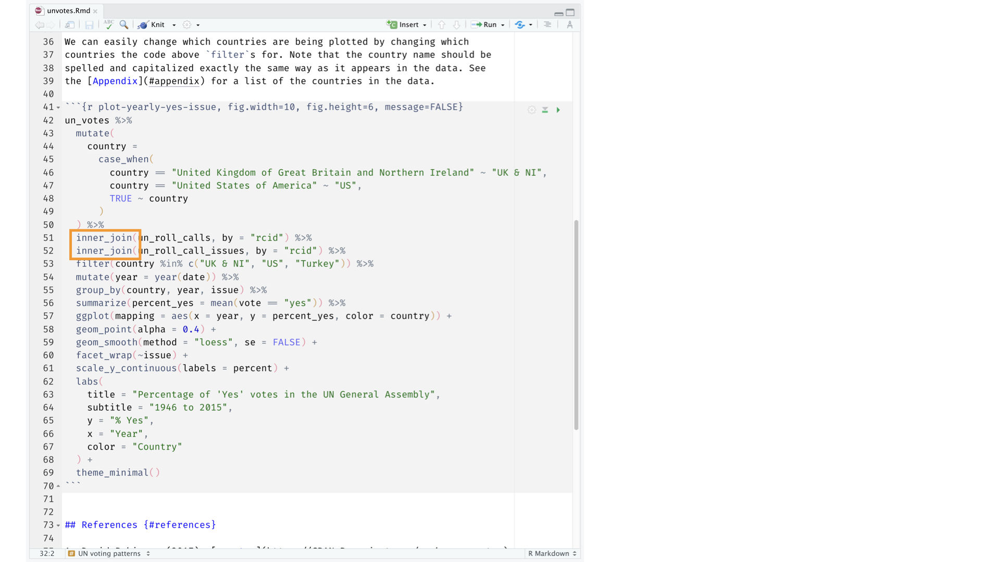

```{r child = "../setup.Rmd"}
```

```{r packages, echo=FALSE, message=FALSE, warning=FALSE}
library(tidyverse)
library(emo)
```


class: inverse

## Data science

.small[*The following content is based on Mine Çetinkaya-Rundel's excellent book Data Science in a Box*
]

.pull-left-wide[

- This is a course on data science with `R` and `SQL`

- Data science is an exciting discipline that allows you to turn raw data into understanding, insight, and knowledge. 

- The focus of our course is on **data wrangling** and **modeling**.


]


???
Course FAQ

.pull-left-wide[
**Q - What data science background does this course assume?**  
A - None.

**Q - Is this an intro stat course?**  
A - While statistics $\ne$ data science, they are very closely related and have tremendous of overlap. Hence, this course is a great way to get started with statistics. However this course is *not* your typical high school statistics course.

**Q - Will we be doing computing?**   
A - Yes.
]

Course FAQ

.pull-left-wide[
**Q - Is this an intro CS course?**  
A - No, but many themes are shared.

**Q - What computing language will we learn?**  
A - R.

**Q: Why not language X?**  
A: We can discuss that over `r emo::ji("coffee")`.
]

---

class: inverse, middle

# Software

---
class: inverse

```{r echo=FALSE, out.width="75%", fig.align="left"}
knitr::include_graphics("img/excel.png")
```

---
class: inverse

```{r echo=FALSE, out.width="50%", fig.align="left"}
knitr::include_graphics("img/r.png")
```

---
class: inverse

```{r echo=FALSE, out.width="73%", fig.align="left"}
knitr::include_graphics("img/rstudio.png")
```

---

class: inverse, middle

# Data science life cycle

---
class: inverse


```{r echo=FALSE, out.width="90%", fig.align="left"}
knitr::include_graphics("img/data-science-cycle/data-science-cycle.001.png")
```

---
class: inverse

```{r echo=FALSE, out.width="90%", fig.align="left"}
knitr::include_graphics("img/data-science-cycle/data-science-cycle.002.png")
```

---
class: inverse

```{r echo=FALSE, out.width="90%", fig.align="left"}
knitr::include_graphics("img/data-science-cycle/data-science-cycle.003.png")
```

---
class: inverse

```{r echo=FALSE, out.width="90%", fig.align="left"}
knitr::include_graphics("img/data-science-cycle/data-science-cycle.004.png")
```

---
class: inverse

```{r echo=FALSE, out.width="90%", fig.align="left"}
knitr::include_graphics("img/data-science-cycle/data-science-cycle.005.png")
```

---
class: inverse

```{r echo=FALSE, out.width="90%", fig.align="left"}
knitr::include_graphics("img/data-science-cycle/data-science-cycle.006.png")
```

---
class: inverse

.pull-left[
```{r echo=FALSE, out.width="75%", fig.align="left"}
knitr::include_graphics("img/google-trend-index.png")
```
]
.pull-right[
```{r echo=FALSE, out.width="90%", fig.align="right"}
knitr::include_graphics("img/data-science-cycle/data-science-cycle.006.png")
```
]

---
class: inverse

.pull-left[
```{r echo=FALSE, out.width="75%", fig.align="left"}
knitr::include_graphics("img/google-trend-index.png")
```
]
.pull-right[
```{r echo=FALSE, out.width="90%", fig.align="right"}
knitr::include_graphics("img/data-science-cycle/data-science-cycle.006.png")
```
```{r echo=FALSE}
travel <- tribble(
  ~date,              ~season,
  "23 January 2017",  "winter",
  "4 March 2017",     "spring",
  "14 June 2017",     "summer",
  "1 September 2017", "fall",
  "...", "..."
)
travel
```
]

---
class: inverse

```{r echo=FALSE, out.width="90%", fig.align="left"}
knitr::include_graphics("img/data-science-cycle/data-science-cycle.007.png")
```

---
class: inverse

```{r echo=FALSE, out.width="90%", fig.align="left"}
knitr::include_graphics("img/data-science-cycle/data-science-cycle.008.png")
```

---
class: inverse

```{r echo=FALSE, out.width="90%", fig.align="left"}
knitr::include_graphics("img/data-science-cycle/data-science-cycle.009.png")
```

---
class: inverse

```{r echo=FALSE, out.width="85%", fig.align="left"}
knitr::include_graphics("img/unvotes/unvotes.gif")
```

---

class: inverse, middle

# Let's dive in!

---
class: inverse


background-image: url("img/unvotes/unvotes-01.jpeg")

---

class: inverse

```{r echo=FALSE, out.width="100%"}
knitr::include_graphics("img/unvotes/unvotes-02.jpeg")
```

---

class: inverse

```{r echo=FALSE, out.width="100%"}
knitr::include_graphics("img/unvotes/unvotes-03.jpeg")
```

---

class: inverse

```{r echo=FALSE, out.width="100%"}
knitr::include_graphics("img/unvotes/unvotes-04.jpeg")
```

---

class: inverse

```{r echo=FALSE, out.width="100%"}
knitr::include_graphics("img/unvotes/unvotes-05.jpeg")
```

---

class: inverse

```{r echo=FALSE, out.width="100%"}
knitr::include_graphics("img/unvotes/unvotes-06.jpeg")
```

---

class: inverse

```{r echo=FALSE, out.width="100%"}
knitr::include_graphics("img/unvotes/unvotes-07.jpeg")
```

---

class: inverse

```{r echo=FALSE, out.width="90%"}
knitr::include_graphics("img/unvotes/unvotes-08.jpeg")
```

---

class: inverse

```{r echo=FALSE, out.width="90%"}

```

---

class: inverse

```{r echo=FALSE, out.width="90%"}
knitr::include_graphics("img/unvotes/unvotes-10.jpeg")
```

---

class: inverse

```{r echo=FALSE, out.width="90%"}
knitr::include_graphics("img/unvotes/unvotes-11.jpeg")
```

---

class: inverse

```{r echo=FALSE, out.width="90%"}
knitr::include_graphics("img/unvotes/unvotes-12.jpeg")
```

---

class: inverse

```{r echo=FALSE, out.width="100%"}
knitr::include_graphics("img/unvotes/unvotes-13.jpeg")
```

---

class: inverse

```{r echo=FALSE, out.width="100%"}
knitr::include_graphics("img/unvotes/unvotes-14.jpeg")
```

---
class: inverse


.center[
.large[
[minecr.shinyapps.io/unvotes](https://minecr.shinyapps.io/unvotes/)
]
]

```{r echo=FALSE, out.width="65%"}
knitr::include_graphics("img/unvotes/unvotes-15.png")
```


---
class: inverse, middle


- RStudio-Cloud

