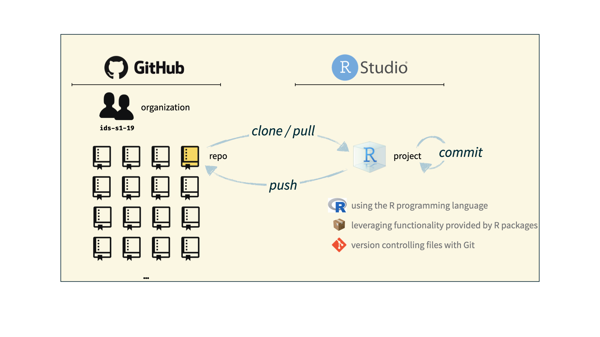

```{r child = "../setup.Rmd"}
```

```{r packages, echo=FALSE, message=FALSE, warning=FALSE}
library(tidyverse)
library(viridis)
library(sugrrants)
library(lubridate)
```


class: inverse, middle

# Git and GitHub

---
class: inverse

.small[*The following content is based on Mine Çetinkaya-Rundel's excellent book Data Science in a Box*]

## Git and GitHub

.pull-left[
```{r echo=FALSE, out.width="25%"}
knitr::include_graphics("img/git-logo.png")
```
- Git is a version control system -- like “Track Changes” features from Microsoft Word, on steroids
- It's not the only version control system, but it's a very popular one
]
.pull-right[
```{r echo=FALSE, out.width="25%"}
knitr::include_graphics("img/github-logo.png")
```
- GitHub is the home for your Git-based projects on the internet -- like DropBox but much, much better

- We will use GitHub as a platform for web hosting and collaboration (and as our course management system!)
]

---
class: inverse


## Versioning

```{r echo=FALSE, fig.align = "center", out.width = "70%"}
knitr::include_graphics("img/lego-steps.png")
```

---
class: inverse


## Versioning 

### with human readable messages

```{r echo=FALSE, fig.align = "center", out.width = "60%"}
knitr::include_graphics("img/lego-steps-commit-messages.png")
```

---
class: inverse


## Why do we need version control?

```{r echo=FALSE, fig.align = "center", out.width="35%"}
knitr::include_graphics("img/phd_comics_vc.gif")
```

---
class: inverse


## How will we use Git and GitHub?

```{r echo=FALSE, out.width="100%"}
knitr::include_graphics("img/whole-game-01.png")
```

---
class: inverse


## How will we use Git and GitHub?

```{r echo=FALSE, out.width="100%"}
knitr::include_graphics("img/whole-game-02.png")
```

---
class: inverse


## How will we use Git and GitHub?

```{r echo=FALSE, out.width="100%"}
knitr::include_graphics("img/whole-game-03.png")
```

---
class: inverse


## How will we use Git and GitHub?

```{r echo=FALSE, out.width="100%"}

```

---
class: inverse


# Git and GitHub tips

- There are a lot of git commands but 99% of the time you will use git to `add`, `commit`, `push`, and `pull`.

--

- We will be doing Git things and interfacing with GitHub through RStudio and [GitHub Desktop](https://desktop.github.com).

--

- There is a great resource for working with git and R: [happygitwithr.com](http://happygitwithr.com/). 

---
class: inverse


## Tour: Git and GitHub

- [Create a GitHub account](https://github.com)

- Verify your GitHub email

- Adjust your GitHub settings for a more pleasant GitHub experience
  - Settings > Emails > Uncheck "Keep my email address private" (note: your email will not be made visible. This step is important to link GitHub to RStudio-Cloud)
  - Settings > Emails > Update name and photo

